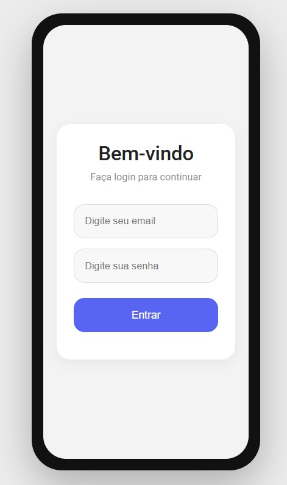
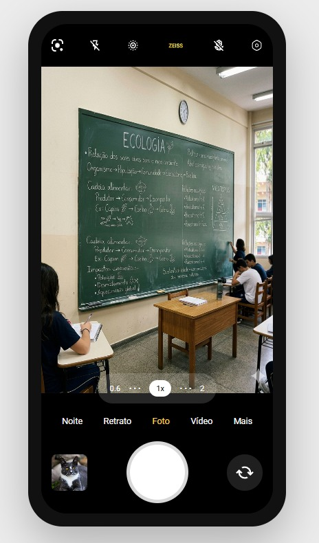

# Challenge Jovi
Entrega para as disciplinas de Front-End e Web Development

## Descrição do projeto
Este projeto tem como objetivo desenvolver uma solução que utiliza a câmera do celular JOVI para ajudar os estudantes na organização e revisão de conteúdos acadêmicos. A partir de imagens capturadas, o sistema identifica, extrai o texto, classifica a matéria e o tema, gera resumos automáticos e organiza todo o material em pastas dentro de um app de estudos, facilitando a rotina de aprendizagem.

## Tecnologias utilizadas no projeto:
* HTML
* CSS
* JavaScript

## Imagens do projeto

 width="300"
